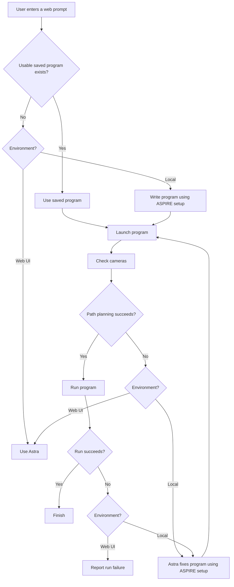

# Aspire UI structure

This is the approved local/web contract. A usable saved program includes a compatible generic template with every task input bound, or a compatible exact-task program. Selection must preserve the complete prompt; unsupported conditions require generation locally or Astra on the web.

Reference: [ASPIRE Code Review Chart Draft](https://chatgpt.com/space/page_40fa89b9faf4819186bd17eb62fb1453).

Saved programs take the fast path without a coding request or an extra initial offline pass. New local code receives complete offline native validation. Every admitted program enters ordinary queue/Home, captures fresh scene/state and fully plans before task motion. Success means verified success after parking. Local recoverable code or native planning failures go to ASPIRE Astra diagnosis with the exact latest source and measured failure, followed by validation and fresh admission. Local failed or unverified physical outcomes supply checks, measured state, images and native feedback to the same repair path. Each later failure requires its own evidence-driven diagnosis and validated candidate; a code fix must meaningfully correct the program or its effective inputs/strategy. Identical or cosmetic edits are no progress. An explicitly justified unchanged-code rerun is recorded separately from a code fix and still requires a fresh corrective full plan and the existing budgets. A concrete blocker or unresolved uncertainty ends recovery when no correction is justified.

The shared selection and configured-policy entry points accept `execution_environment='local'|'web'`, defaulting to `web`. The local launcher explicitly selects `local`. Web missing-program and pre-motion failures use ordinary Astra (pre-motion fallback retains the reservation); web physical failures are reported without ASPIRE repair or retry.

Physical retry settings remain 0–3, default 1, frozen per submission; 0 disables physical retries. A separate coding-request budget is carried across all children. Zero-command recoverable live planning failures consume coding requests, not physical retries. Stop, faults, timeouts and uncertain submitted commands fence replay. Durable claims prevent duplicates; activation does not replay historical or exhausted tasks.
